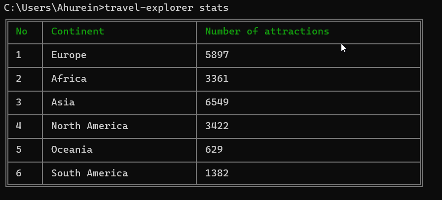

# Travel Explorer

> CLI utility to easily browse attractions in every country/city

## Features

- Get attractions by city
- Get attractions by country
- Get attractions by continent
- `Flights` and `hotels` will be available in future update

## Example


## Install

```sh
# Install globally (recommended).
npm install -g travel-explorer

# Or run directly with npx
npx install travel-explorer
```

## Usage

### Attraction prompt
```sh
travel-explorer attractions
```


### Attraction options
- By country
```sh
travel-explorer -c Ghana
# or
travel-explorer --country Ghana
```
- By city
```sh
travel-explorer -t Accra
# or
travel-explorer --city Accra
```
- By continent
```sh
travel-explorer -n Africa
# or
travel-explorer --continent Africa
```

### Statistics
```sh
travel-explorer stats
```

