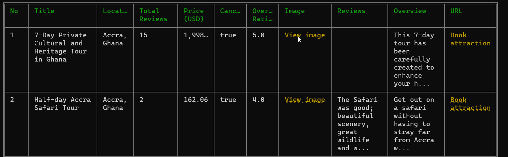
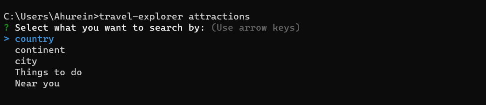

# Travel Explorer

> CLI utility to easily browse attractions in every country/city

## Features

- Get attractions by city
- Get attractions by country
- Get attractions by continent
- `Flights` and `hotels` will be available in future update

## Example


## Install

```sh
# Install globally (recommended).
npm install -g @ahurein/travel-explorer

yarn global add @ahurein/travel-explorer
```

## Usage

### Attraction prompt
```sh
travel-explorer attractions
```


### Attraction options
- By country
```sh
travel-explorer attractions -c Ghana
# or
travel-explorer attractions --country Ghana
```
- By city
```sh
travel-explorer attractions -t Accra
# or
travel-explorer attractions --city Accra
```
- By continent
```sh
travel-explorer attractions -n Africa
# or
travel-explorer attractions --continent Africa
```

### Statistics
```sh
travel-explorer attractions stats
```


## Contribution
To contribute ideas to the project, contact me or send a PR. All Codes are available [here](https://github.com/Ahurein/travel-explorer-cli)
- [Github](https://github.com/ahurein)
- [LinkedIn](https://www.linkedin.com/in/ebenezer-ahurein/)
